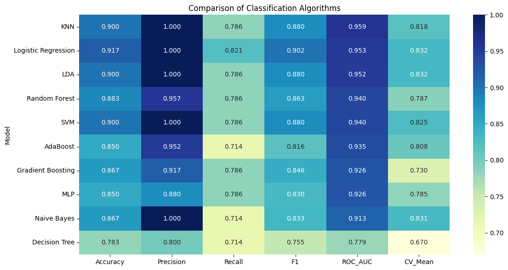

# Heart Disease Classifier Benchmark




## Overview

This project presents a comprehensive benchmark of classical machine learning classification algorithms for heart disease prediction using the Cleveland Heart Disease dataset. Multiple models are trained, evaluated, and compared using a wide range of performance metrics and visualization techniques.

---

## Dataset

- **Dataset:** Heart Disease Cleveland UCI
- **Target Variable:** `condition`
- **Type:** Binary Classification

---

## Algorithms Implemented

- Logistic Regression
- Linear Discriminant Analysis (LDA)
- K-Nearest Neighbors (KNN)
- Gaussian Naive Bayes
- Decision Tree
- Random Forest
- Support Vector Machine (SVM)
- AdaBoost
- Gradient Boosting
- Multi-Layer Perceptron (MLP)

---

## Evaluation Metrics

The models are evaluated using:

- Accuracy
- Precision
- Recall
- F1 Score
- ROC-AUC
- Balanced Accuracy
- Matthews Correlation Coefficient (MCC)
- Cohen's Kappa
- Log Loss
- Cross Validation Mean
- Cross Validation Standard Deviation
- Training Time
- Prediction Time

---

## Visualizations

The project includes:

- Confusion Matrix
- ROC Curve
- Precision–Recall Curve
- Learning Curve
- Validation Curve
- Calibration Curve
- Feature Importance
- Accuracy Comparison
- Precision Comparison
- Recall Comparison
- F1 Score Comparison
- ROC-AUC Comparison
- Metrics Heatmap
- Cross Validation Boxplot

---

## Repository Structure

```
heart-disease-classifier-benchmark/

├── datasets/
├── notebooks/
├── figures/
├── results/
├── src/
├── README.md
├── requirements.txt
└── LICENSE
```

---

## Installation

```bash
git clone https://github.com/nishateeha49du-a11y/heart-disease-classifier-benchmark.git
cd heart-disease-classifier-benchmark

pip install -r requirements.txt
```

---

---

## 🏆 Best Performing Model

Based on the comprehensive evaluation of ten classical machine learning classification algorithms on the Cleveland Heart Disease dataset, **Logistic Regression** achieved the best overall performance.

| Metric | Value |
|--------|------:|
| Rank | **1** |
| Accuracy | **91.67%** |
| Precision | **100.00%** |
| Recall | **82.14%** |
| F1 Score | **90.20%** |
| ROC-AUC | **95.31%** |

For the complete ranking of all classifiers, see:

- `results/best_model.csv`
- `results/comparison.csv`
- `notebooks/11_Model_Comparison.ipynb`

## Technologies Used

- Python
- NumPy
- Pandas
- Matplotlib
- Seaborn
- Scikit-Learn
- Jupyter Notebook


